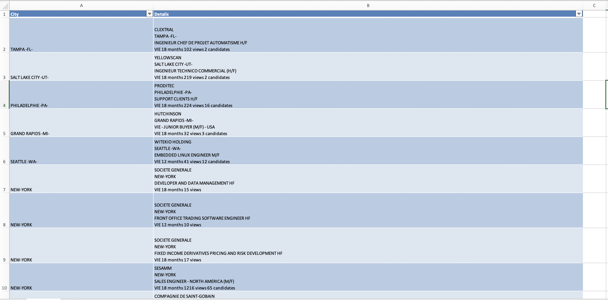

# VIE-VIA-Business-France-USA-Export
***

This python using selenium webdriver script allows you to export VIE/VIA offers from mon-vie-via.businessfrance.frin xlsx format.
This allows you to filter offers by cities in excel format.

For the example I used USA but you can choose whatever contry/filter you want.

##Google Maps Engine visualisation

You can export this xlsx file into google maps engine to see offers on a map.
I used the following tutorial to do it : <a href="https://jemeformeaunumerique.fr/2013/12/01/tutoriel-creer-une-carte-google-map-a-partir-dune-liste-dadresses/#:~:text=Importer%20le%20fichier%20Excel%20contenant%20les%20points%20adresses&text=Pour%20cela%2C%20cliquez%20sur%20le,d'une%20autre%20carte%20existante.">Link</a>

##How to run the project 

1) Clone the repo
2) Download the lastest chrome driver version on https://sites.google.com/chromium.org/driver/
3) Open the repo with PyCharm community (https://www.jetbrains.com/fr-fr/pycharm/download/) or any other Python IDE
4) Run the following command on your folder 'pip install selenium'
5) Run the following command on your folder 'pip install xlswriter'
6) Change the driver path link in export.py
   Optional
7) Change the link path in export.py to collect cities in the country you want

   
You can now export your data using this script inside export-vie.xlsx 

##Technology 
Python 3.8.5

Selenium 4

##Licence 

Autor : Timothée Marguier 

Licence : GNU GENERAL PUBLIC LICENSE
